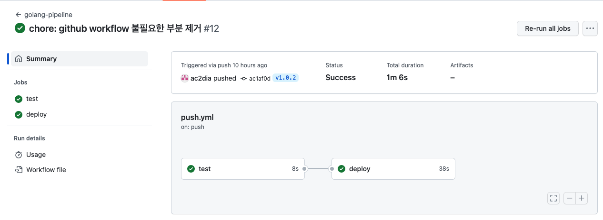
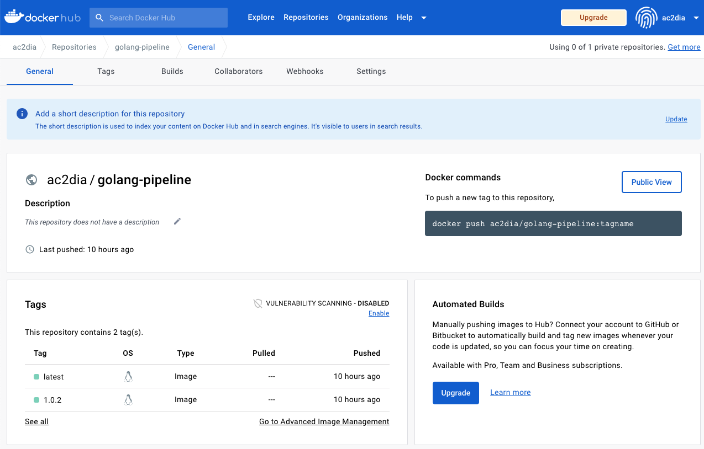

# 🐑 golang-pipeline
- CI/CD 학습을 위한 GitHub Workflow 샘플입니다. 

# 📚 기술 스택
- go 1.18
- docker / kubernetes
- docker-hub / Harbor
- github workflow / ArgoCD

# 🛠 아키텍처
- **추가 필요**

# 🌟 주요 기능
- GitHub Workflow 를 통해 생성한 두 가지 JOB 이 있으며 commit-push 실행시 hook 이벤트 발생 

- 첫 번째 JOB 의 경우 go unit test 를 위한 명령어 실행
  - master 브랜치 또는 tag 인 경우
- 두 번째 JOB 의 경우 docker build 이 후 DockerHub Repository 로 푸시
  - tag 인 경우

# 🌠 실행 화면
- [1] Tag 에 대한 Push 발생시 동작하는 화면

- [2] Deploy 과정 이 후 DockerHub 에 생성된 화면

# 😎 짧은 평
- GitHub Actions 의 Workflow 를 학습함으로써 Event, Job, Step 의 개념 및 사용 방법 습득
- GitHub Actions 페이지에서 제공하는 workflow 종류
  - Automation, CI, Deployment, Security, Pages

# 🎃 TODO
- OpenStack 구축
  - IaaS Infra 환경 구축
- Private Registry
  - 컨테이너 이미지 레지스트리 저장소
- Kubernetes 구축
  - App 배포 환경
  - ArgoCD 배포
- ArgoCD 를 이용하여 쿠버네티스 상에 배포
  - pod, replicaset, deployment, service(nodePort) 리소스를 이용하여 배포
  - ingress controller 를 활용한 무중단 업데이트
