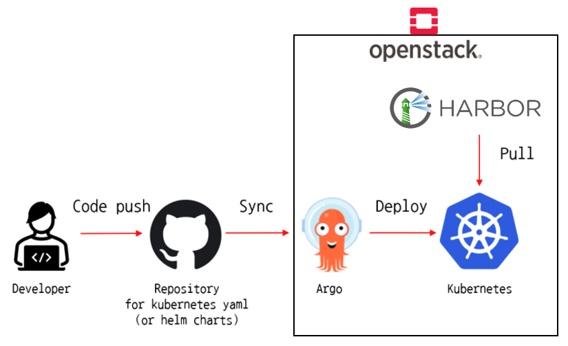
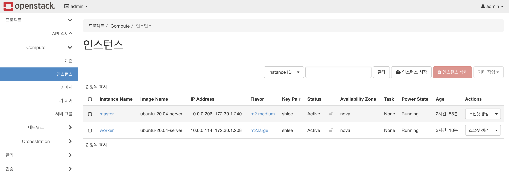
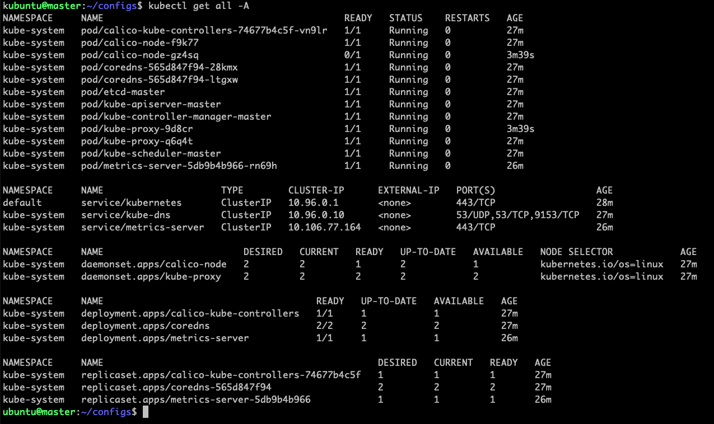

# 🐑 pipeline

- CI/CD 학습을 위한 GitHub Workflow 샘플입니다.
- OpenStack 인프라 환경에서 Kubernetes, Harbor, ArgoCD 등을 이용하려고 합니다.

# 📚 기술 스택

- openstack / kolla-ansible / xena
- cri-o / kubernetes v1.25
- Harbor
- github workflow / ArgoCD

- golang based web application sample

# 🛠 아키텍처

# 🌟 주요 기능

- OpenStack 구축
  - IaaS Infra 환경 구축
- Private Registry
  - 컨테이너 이미지 레지스트리 저장소
- Kubernetes 구축
  - App 배포 환경
  - ArgoCD 배포

# 🌠 실행 화면

[1] OpenStack 인프라

[2] kubernetes 구성

[3] Harbor 배포 및 설정

- 추가 필요

[4] ArgoCD 배포 및 설정

- 추가 필요

[5] GitHub Repository 생성 및 Helm Chart 작성

- 추가 필요

[6] 전체 플로우 확인

- 추가 필요

# 😎 짧은 평

- GitHub Actions 의 Workflow 를 학습함으로써 Event, Job, Step 의 개념 및 사용 방법 습득
- GitHub Actions 페이지에서 제공하는 workflow 종류
  - Automation, CI, Deployment, Security, Pages
- ArgoCD 학습
- Helm Chart 학습

# 🎃 TODO

- ArgoCD 설정
  - GitHub에 Helm Chart 이용한 Repository 생성 후 연동
- GitHub Workflow 를 통해 테스트, 이미지 빌드
- Helm Chart Repository 의 Helm Chart 갱신

- ArgoCD 에서 Helm Chart Repository 변경사항을 확인한 후 쿠버네티스에 헬름 차트 배포
  - pod, replicaset, deployment, service(nodePort) 리소스를 이용하여 배포
  - ingress controller 를 활용한 무중단 업데이트
